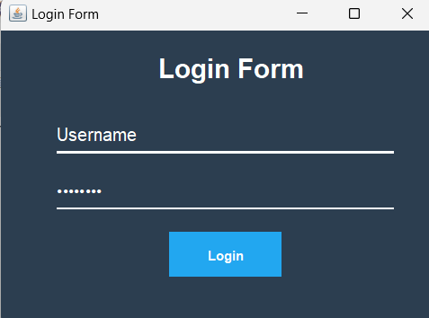
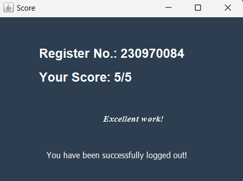

# Java Swing Quiz Application

## Description
This application uses Mysql database to store the student information like name, registration no. and marks. The student can attend the quiz and score would be displayed. 

## Installation
Instructions on how to set up and run your project.

```sh
# Clone the repository
git clone https://github.com/valinamendonca/Quiz-App-Java-Swings.git

# Navigate to the project directory
cd Quiz-App-Java-Swings

#Set up the database
Set up ur database username, password and name in the Connection.java file.

# Compile the Java files
javac -d bin src/*.java

# Run the application
java -cp bin com.yourpackage.MainClass
```

## Screenshots
Here are some screenshots of the application:






